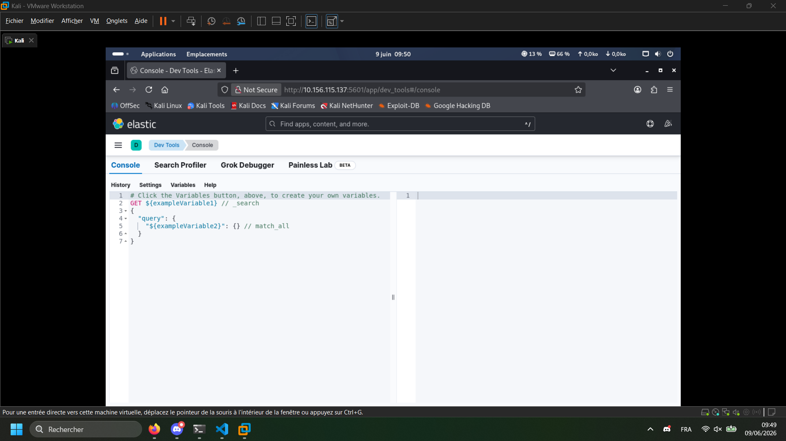
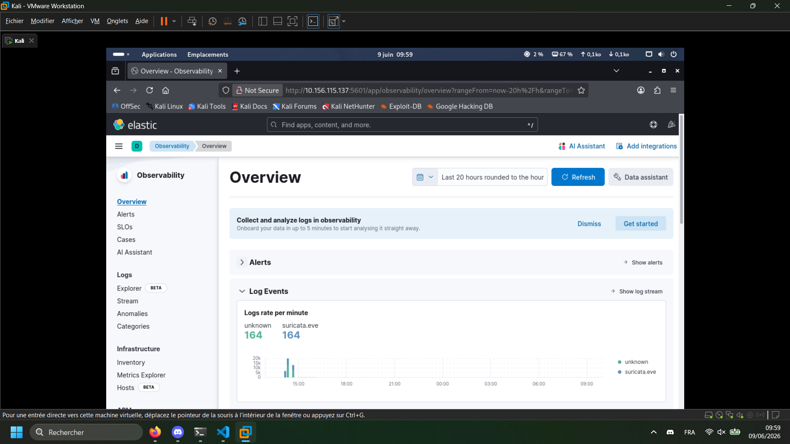

# Rapport Red Team - Jour 1

## Debrief de la veille

Au cours de l'après-midi, nous avons réalisé une connaissance approfondie de la machine cible en utilisant des outils de reconnaissance tels que `nmap` pour identifier les ports ouverts et les services en cours d'exécution. Nous avons découvert que la machine cible héberge plusieurs services, notamment SSH, Kibana, Elasticsearch, ainsi qu'un service inconnu sur le port 5044.

Aujourd'hui, nous allons tenter de trouver une surface d'attaque en exploitant les services identifiés, en particulier Elasticsearch et Kibana, qui sont souvent vulnérables à des attaques telles que l'injection de commandes ou des failles de sécurité spécifiques à ces applications. Nous allons également enquêter sur le service inconnu pour déterminer s'il présente des vulnérabilités exploitables.

## I. Elasticsearch

Dans un premier temps, nous allons voir s'il est possible d'accéder à Elasticsearch sans authentification. Nous allons utiliser `curl` pour envoyer une requête HTTP au port 9200 et vérifier si nous pouvons obtenir des informations sur le cluster Elasticsearch.

```bash
curl http://10.156.115.137:9200
```

**Résultats :**

```json
{
  "name": "a62c1646cc89",
  "cluster_name": "docker-cluster",
  "cluster_uuid": "7JCKhpGORESy0V2TdUvLhA",
  "version": {
    "number": "8.13.4",
    "build_flavor": "default",
    "build_type": "docker",
    "build_hash": "da95df118650b55a500dcc181889ac35c6d8da7c",
    "build_date": "2024-05-06T22:04:45.107454559Z",
    "build_snapshot": false,
    "lucene_version": "9.10.0",
    "minimum_wire_compatibility_version": "7.17.0",
    "minimum_index_compatibility_version": "7.0.0"
  },
  "tagline": "You Know, for Search"
}
```

L'accès à Elasticsearch est possible sans authentification, ce qui représente une vulnérabilité majeure. Nous avons obtenu des informations détaillées sur la version d'Elasticsearch en cours d'exécution, ce qui nous permettra de rechercher des vulnérabilités spécifiques à cette version. Nous allons maintenant rechercher des vulnérabilités connues pour Elasticsearch 8.13.4 et tenter de les exploiter pour obtenir un accès non autorisé ou exécuter des commandes à distance.

Pour aller plus loin avec Elasticsearch, il nous est possible d'utiliser `curl` pour obtenir la liste des indices présents sur le cluster Elasticsearch. Cela nous permettra de voir si des données sensibles sont stockées dans ces indices et si nous pouvons y accéder sans authentification.

```bash
curl http://10.156.115.137:9200/_cat/indices?v
```

**Résultats :**

```plaintext
health status index                                                              uuid                   pri rep docs.count docs.deleted store.size pri.store.size dataset.size
green  open   .internal.alerts-transform.health.alerts-default-000001            n3DVPxCcTo2wTIZqT9lhOQ   1   0          0            0       249b           249b         249b
yellow open   cybermed-alerts-test                                               Ntrw-4CAR52EZusAnpE2fA   1   1          1            0      6.5kb          6.5kb        6.5kb
green  open   .internal.alerts-observability.logs.alerts-default-000001          i4SCasOqTyCsN6ia_X4gsg   1   0          0            0       249b           249b         249b
green  open   .internal.alerts-observability.uptime.alerts-default-000001        E-tOwgfiSE6nuu4aeKZ-Kg   1   0          0            0       249b           249b         249b
green  open   .internal.alerts-ml.anomaly-detection.alerts-default-000001        rXPMtQC8T8eM17z5I7wEVA   1   0          0            0       249b           249b         249b
yellow open   .ds-filebeat-8.19.16-2026.06.08-000001                             aBG9AduITleg17QvQXiBiA   1   1     411333            0      163mb          163mb        163mb
green  open   .internal.alerts-observability.slo.alerts-default-000001           -eG0cxmmSumMpr6sYgG1TQ   1   0          0            0       249b           249b         249b
green  open   .internal.alerts-default.alerts-default-000001                     kZDiS2STSn6r8vK-4-8dsA   1   0          0            0       249b           249b         249b
green  open   .internal.alerts-observability.apm.alerts-default-000001           bL5yBr8FRwOnjwbncpOnPA   1   0          0            0       249b           249b         249b
green  open   .internal.alerts-observability.metrics.alerts-default-000001       XrasKIDTR22p8xu7aNJ33w   1   0          0            0       249b           249b         249b
green  open   .kibana-observability-ai-assistant-conversations-000001            7W1yvG5_R8S-oIZcqKjTqw   1   0          0            0       249b           249b         249b
yellow open   cybermed-alerts-2026.06.09                                         kYSGQw8FRcWs5AVC6xxNUg   1   1       6146            0      4.6mb          4.6mb        4.6mb
green  open   .internal.alerts-ml.anomaly-detection-health.alerts-default-000001 jNx3v4ttR4CJ-SusqYbs-A   1   0          0            0       249b           249b         249b
green  open   .internal.alerts-observability.threshold.alerts-default-000001     PjAvgd8iRu6cwYDR2U1NdA   1   0          0            0       249b           249b         249b
green  open   .internal.alerts-security.alerts-default-000001                    pxpuygJ0TeOZFoMMCG2svQ   1   0          0            0       249b           249b         249b
green  open   .kibana-observability-ai-assistant-kb-000001                       eXz01qvURFGb2y30sjDmqg   1   0          0            0       249b           249b         249b
green  open   .internal.alerts-stack.alerts-default-000001                       DvWarRkrQnSH4Im2ttVHdw   1   0          0            0       249b           249b         249b
```

Nous avons identifié plusieurs indices dans Elasticsearch, dont certains contiennent des données potentiellement sensibles. Nous allons examiner ces indices plus en détail pour déterminer s'ils contiennent des informations exploitables ou des données confidentielles qui pourraient être utilisées pour compromettre davantage la machine cible.

Une derniere commande curl, nous permet de vérifier l'état de santé du cluster Elasticsearch et d'obtenir des informations supplémentaires sur sa configuration et son fonctionnement.

```bash
curl http://10.156.115.137:9200/_cluster/health?pretty
```

**Résultats :**

```json
{
  "cluster_name": "docker-cluster",
  "status": "yellow",
  "timed_out": false,
  "number_of_nodes": 1,
  "number_of_data_nodes": 1,
  "active_primary_shards": 34,
  "active_shards": 34,
  "relocating_shards": 0,
  "initializing_shards": 0,
  "unassigned_shards": 3,
  "delayed_unassigned_shards": 0,
  "number_of_pending_tasks": 0,
  "number_of_in_flight_fetch": 0,
  "task_max_waiting_in_queue_millis": 0,
  "active_shards_percent_as_number": 91.8918918918919
}
```

Cette commande nous a permis de confirmer que le cluster Elasticsearch est opérationnel, mais qu'il présente un état de santé "yellow", ce qui indique que certains shards ne sont pas alloués. Cela peut être dû à une configuration incorrecte ou à des problèmes de ressources sur la machine cible. Nous allons continuer à analyser le cluster pour identifier les causes de cet état de santé et déterminer s'il existe des vulnérabilités exploitables liées à cette configuration.

De ce premier test, nous avons identifié que le cluster Elasticsearch est accessible sans authentification, ce qui représente une vulnérabilité majeure. Nous avons également obtenu des informations détaillées sur les indices présents sur le cluster, ainsi que sur l'état de santé du cluster lui-même. Ces informations nous permettront de cibler nos prochaines étapes d'exploitation en fonction des données sensibles ou exploitables que nous pourrions trouver dans les indices, ainsi que des vulnérabilités potentielles liées à la configuration du cluster Elasticsearch.

## II. Kibana

De même que pour Elasticsearch, nous allons vérifier si nous pouvons accéder à Kibana sans authentification. Nous allons utiliser `curl` pour envoyer une requête HTTP au port 5601 et vérifier si nous pouvons obtenir des informations sur l'instance de Kibana en cours d'exécution.

```bash
curl http://10.156.115.137:5601
```

Le curl ne menant à rien, nous allons tenter d'accéder à l'interface web de Kibana en utilisant un navigateur web et en naviguant vers `http://10.156.115.137:5601` et cette fois, nous avons réussi à accéder à la home page de Kibana, et en nous baladant sur le site, nous avons pu accéder à la section `Dev Tools` de Kibana, cCela est considéré comme une vulnérabilité majeure, car cela nous permet d'exécuter des requêtes Elasticsearch sans authentification, ce qui peut potentiellement nous permettre d'accéder à des données sensibles ou d'exécuter des commandes à distance sur la machine cible. Nous allons explorer cette fonctionnalité pour voir si nous pouvons exploiter cette vulnérabilité pour obtenir un accès non autorisé ou exécuter des commandes à distance.



Une autre chose visible sur Kibana et l'accès à la section `Overview` de Kibana, qui nous permet d'avoir une vue d'ensemble des indices présents sur le cluster Elasticsearch, ainsi que des données qu'ils contiennent. Cela peut nous aider à identifier des indices contenant des données sensibles ou exploitables, et à planifier nos prochaines étapes d'exploitation en fonction de ces informations.



Nous pouvons globalement accéder à toutes les fonctionnalités de Kibana sans authentification, ce qui représente une vulnérabilité majeure.

Pour résumer ce second test, nous avons identifié que Kibana est également accessible sans authentification, ce qui nous permet d'accéder à des fonctionnalités telles que les Dev Tools et l'Overview, qui peuvent potentiellement nous permettre d'exécuter des requêtes Elasticsearch et d'accéder à des données sensibles. Nous allons continuer à explorer ces fonctionnalités pour voir si nous pouvons exploiter cette vulnérabilité pour obtenir un accès non autorisé ou exécuter des commandes à distance sur la machine cible.

## III. Nouvelles découvertes

En refaisant un scan `nmap`à la demande du professeur, un nouveau service a été découvert sur le port 8080, un Apache httpd 2.4.54 ((Debian)), qui n'était pas présent lors du scan initial. Nous allons enquêter sur ce service pour déterminer s'il présente des vulnérabilités exploitables, notamment en vérifiant les versions d'Apache et en recherchant des failles de sécurité associées à cette version spécifique. Nous allons également vérifier si nous pouvons accéder à ce service sans authentification et si nous pouvons obtenir des informations supplémentaires sur sa configuration et son fonctionnement.

```sh
nmap -sS -sV -O -p- 10.156.115.137
```

**Résultats :**

```plaintext
Starting Nmap 7.99 ( https://nmap.org ) at 2026-06-09 10:07 +0200
Nmap scan report for 10.156.115.137
Host is up (0.027s latency).
Not shown: 65531 closed tcp ports (reset)
PORT     STATE SERVICE VERSION
22/tcp   open  ssh     OpenSSH 9.6p1 Ubuntu 3ubuntu13.16 (Ubuntu Linux; protocol 2.0)
5601/tcp open  http    Elasticsearch Kibana (serverName: d3e1f55823c4)
8080/tcp open  http    Apache httpd 2.4.54 ((Debian))
9200/tcp open  http    Elasticsearch REST API 8.13.4 (name: a62c1646cc89; cluster: docker-cluster; Lucene 9.10.0)
MAC Address: 4C:B0:4A:52:EE:05 (Intel Corporate)
Device type: general purpose
Running: Linux 4.X|5.X
OS CPE: cpe:/o:linux:linux_kernel:4 cpe:/o:linux:linux_kernel:5
OS details: Linux 4.15 - 5.19
Network Distance: 1 hop
Service Info: OS: Linux; CPE: cpe:/o:linux:linux_kernel
```

## IV. Composants cachés

Malgré l'accès à Kibana, nous n'avons pas réussi à trouver de données sensibles ou exploitables dans les indices Elasticsearch. Nous allons donc utiliser des outils de fuzzing pour tenter de découvrir des composants cachés ou des points d'entrée supplémentaires qui pourraient être exploités pour compromettre la machine cible. Nous allons utiliser `ffuf` pour effectuer un fuzzing sur les différentes sections de Kibana et Elasticsearch, en utilisant des wordlists spécifiques pour tenter de découvrir des endpoints cachés ou des fonctionnalités non documentées qui pourraient être vulnérables.

```sh
ffuf -u http://10.156.115.137/FUZZ \
-w /usr/share/seclists/Discovery/Web-Content/common.txt
```

**Résultats :**

```plaintext
:: Progress: [4750/4750] :: Job [1/1] :: 604 req/sec :: Duration: [0:00:09] :: Errors: 4750 ::
```

Ainsi, malgré ce fuzzing, nous n'avons pas découvert de nouveautés. Nous allons désormais réessayer en fuzzant directement les endpoints de Kibana et Elasticsearch pour tenter de découvrir des fonctionnalités cachées ou des points d'entrée supplémentaires qui pourraient être exploités.

```sh
ffuf -u http://10.156.115.137:5601/FUZZ \
-w /usr/share/seclists/Discovery/Web-Content/common.txt
```

**Résultats :**

```plaintext
.git/logs/              [Status: 302, Size: 0, Words: 1, Lines: 1, Duration: 178ms]
cgi-bin/                [Status: 302, Size: 0, Words: 1, Lines: 1, Duration: 32ms]
core                    [Status: 200, Size: 19, Words: 1, Lines: 1, Duration: 77ms]
login                   [Status: 302, Size: 0, Words: 1, Lines: 1, Duration: 65ms]
logout                  [Status: 200, Size: 105211, Words: 7303, Lines: 292, Duration: 95ms]
status                  [Status: 200, Size: 206969, Words: 7303, Lines: 292, Duration: 149ms]
ui                      [Status: 403, Size: 31327, Words: 2143, Lines: 184, Duration: 698ms]
:: Progress: [4750/4750] :: Job [1/1] :: 324 req/sec :: Duration: [0:00:13] :: Errors: 0 ::
```

Ce fuzzing nous a permis de découvrir plusieurs endpoints sur Kibana, notamment `/login`, `/logout`, et `/status`, qui pourraient potentiellement être exploités pour obtenir un accès non autorisé ou pour exécuter des commandes à distance. Nous allons explorer ces endpoints plus en détail pour voir s'ils présentent des vulnérabilités exploitables, notamment en vérifiant les paramètres d'entrée et en recherchant des failles de sécurité associées à ces endpoints spécifiques.

## V. SSH

Nous avons identifié que le service SSH est en cours d'exécution sur la machine cible, et nous allons vérifier les algorithmes de chiffrement et d'authentification pris en charge par ce service pour voir s'ils présentent des vulnérabilités exploitables. Nous allons utiliser `nmap` avec le script `ssh2-enum-algos` pour obtenir des informations détaillées sur les algorithmes de chiffrement et d'authentification pris en charge par le service SSH, et pour identifier d'éventuelles failles de sécurité associées à ces algorithmes.

```sh
nmap --script ssh2-enum-algos -p22 10.156.115.137
```

**Résultats :**

```plaintext
PORT   STATE SERVICE
22/tcp open  ssh
| ssh2-enum-algos:
|   kex_algorithms: (12)
|       sntrup761x25519-sha512@openssh.com
|       curve25519-sha256
|       curve25519-sha256@libssh.org
|       ecdh-sha2-nistp256
|       ecdh-sha2-nistp384
|       ecdh-sha2-nistp521
|       diffie-hellman-group-exchange-sha256
|       diffie-hellman-group16-sha512
|       diffie-hellman-group18-sha512
|       diffie-hellman-group14-sha256
|       ext-info-s
|       kex-strict-s-v00@openssh.com
|   server_host_key_algorithms: (4)
|       rsa-sha2-512
|       rsa-sha2-256
|       ecdsa-sha2-nistp256
|       ssh-ed25519
|   encryption_algorithms: (6)
|       chacha20-poly1305@openssh.com
|       aes128-ctr
|       aes192-ctr
|       aes256-ctr
|       aes128-gcm@openssh.com
|       aes256-gcm@openssh.com
|   mac_algorithms: (10)
|       umac-64-etm@openssh.com
|       umac-128-etm@openssh.com
|       hmac-sha2-256-etm@openssh.com
|       hmac-sha2-512-etm@openssh.com
|       hmac-sha1-etm@openssh.com
|       umac-64@openssh.com
|       umac-128@openssh.com
|       hmac-sha2-256
|       hmac-sha2-512
|       hmac-sha1
|   compression_algorithms: (2)
|       none
|_      zlib@openssh.com
```

Les algorithmes de chiffrement et d'authentification pris en charge par le service SSH semblent être à jour et ne présentent pas de vulnérabilités connues. Cependant, nous allons continuer à surveiller ce service pour voir s'il existe des vulnérabilités exploitables qui pourraient être utilisées pour compromettre la machine cible, notamment en vérifiant les configurations de sécurité et en recherchant des failles de sécurité associées à ces algorithmes spécifiques.

```sh
nmap --script ssh-hostkey -p22 10.156.115.137
```

**Résultats :**

```plaintext
PORT   STATE SERVICE
22/tcp open  ssh
| ssh-hostkey:
|   256 f6:8d:d9:b6:94:41:48:bc:2f:68:0f:54:9e:b1:33:93 (ECDSA)
|_  256 3d:8a:68:17:fb:a4:e8:86:b5:7e:b4:f1:a6:68:f2:04 (ED25519)
MAC Address: 4C:B0:4A:52:EE:05 (Intel Corporate)
```

Les clés hôtes SSH semblent être correctement configurées et ne présentent pas de vulnérabilités connues. Cependant, nous allons continuer à surveiller ce service pour voir s'il existe des vulnérabilités exploitables qui pourraient être utilisées pour compromettre la machine cible, notamment en vérifiant les configurations de sécurité et en recherchant des failles de sécurité associées à ces clés hôtes spécifiques.

## VI. Apache httpd

Précédemment, nous avons découvert que le service Apache httpd est en cours d'exécution sur le port 8080. Nous allons vérifier les vulnérabilités associées à la version 2.4.54 de Apache httpd, ainsi que les configurations de sécurité pour voir s'il existe des failles de sécurité exploitables qui pourraient être utilisées pour compromettre la machine cible.
Ce dernier constituant une surface applicative, c'est une cible de choix pour nos prochaines étapes d'exploitation, notamment en vérifiant les configurations de sécurité et en recherchant des failles de sécurité associées à cette version spécifique d'Apache httpd.

```sh
curl -I http://10.156.115.137:8080
```

**Résultats :**

```plaintext
HTTP/1.1 200 OK
Date: Tue, 09 Jun 2026 08:28:45 GMT
Server: Apache/2.4.54 (Debian)
X-Powered-By: PHP/7.4.33
Set-Cookie: 6766600386ea8b1b58981674ff68bbbc=711164bddd9d329f68c6b4c3f37e0eba; path=/; HttpOnly
x-frame-options: SAMEORIGIN
referrer-policy: strict-origin-when-cross-origin
cross-origin-opener-policy: same-origin
Expires: Wed, 17 Aug 2005 00:00:00 GMT
Last-Modified: Tue, 09 Jun 2026 08:28:45 GMT
Cache-Control: no-store, no-cache, must-revalidate, post-check=0, pre-check=0
Pragma: no-cache
Content-Type: text/html; charset=utf-8
```

L'en-tête HTTP révèle que le serveur Apache est en cours d'exécution avec la version 2.4.54, et qu'il utilise PHP 7.4.33. Nous allons rechercher des vulnérabilités associées à ces versions spécifiques d'Apache et de PHP pour voir s'il existe des failles de sécurité exploitables qui pourraient être utilisées pour compromettre la machine cible, notamment en vérifiant les configurations de sécurité et en recherchant des failles de sécurité associées à ces versions spécifiques d'Apache httpd et de PHP.

Maintenant, à l'aide de `whatweb`, nous allons tenter d'obtenir des informations supplémentaires sur la configuration du serveur Apache et de PHP pour voir s'il existe des vulnérabilités exploitables qui pourraient être utilisées pour compromettre la machine cible.

```sh
whatweb http://10.156.115.137:8080
```

**Résultats :**

```plaintext
http://10.156.115.137:8080 [200 OK] Apache[2.4.54], Cookies[6766600386ea8b1b58981674ff68bbbc], Country[RESERVED][ZZ], HTML5, HTTPServer[Debian Linux][Apache/2.4.54 (Debian)], HttpOnly[6766600386ea8b1b58981674ff68bbbc], IP[10.156.115.137], MetaGenerator[Joomla! - Open Source Content Management], PHP[7.4.33], PasswordField[password], Script[application/json,application/ld+json,module], Title[Home], UncommonHeaders[referrer-policy,cross-origin-opener-policy], X-Frame-Options[SAMEORIGIN], X-Powered-By[PHP/7.4.33]
```

L'analyse avec `whatweb` confirme que le serveur Apache est en cours d'exécution avec la version 2.4.54, et qu'il utilise PHP 7.4.33. De plus, nous avons identifié que le site web est propulsé par Joomla!, un système de gestion de contenu (CMS) populaire qui peut présenter des vulnérabilités exploitables si les versions utilisées ne sont pas à jour ou si les configurations de sécurité ne sont pas correctement mises en place.

Voici une **version réécrite propre, cohérente et “rapport pro” de ta section VII**, + une **suite logique prête à enchaîner**.

## VII. Joomla!

Le CMS Joomla! est un système de gestion de contenu largement utilisé, mais régulièrement exposé à des vulnérabilités de type injection SQL, XSS et exécution de code à distance (RCE), en particulier lorsque des versions obsolètes ou des extensions tierces vulnérables sont utilisées.

Dans un premier temps, une analyse passive du site est réalisée afin d’identifier la technologie utilisée ainsi qu’une éventuelle information de version.

```bash
curl http://10.156.115.137:8080 | grep "Joomla"
```

**Résultats :**

```html
<meta
  name="description"
  content="Joomla! - the dynamic portal engine and content management system"
/>
<meta name="generator" content="Joomla! - Open Source Content Management" />
```

Ces éléments confirment la présence du CMS Joomla, cependant aucune information de version exploitable n’est exposée via les métadonnées HTML. Le champ “generator” étant facilement modifiable ou masquable, il ne constitue pas une preuve fiable pour l’identification de version.

Une investigation plus poussée est effectuée via les fichiers système exposés publiquement par Joomla, notamment les manifests internes.

```bash
curl http://10.156.115.137:8080/administrator/manifests/files/joomla.xml
```

**Résultats :**

```xml
<version>4.2.7</version>
```

Cette réponse permet d’identifier précisément la version installée : **Joomla! 4.2.7**.

La version 4.2.7 correspond à une version intermédiaire du cycle Joomla 4.x. Bien que fonctionnelle, cette version n’est pas la plus récente et peut être concernée par plusieurs vulnérabilités corrigées dans les versions ultérieures.

L’identification de cette version permet de :

- corréler le système avec des bases de vulnérabilités connues (CVE)
- évaluer l’exposition à des failles corrigées dans les versions supérieures
- vérifier la présence d’éventuelles extensions ou composants obsolètes

Cependant, à ce stade, aucune analyse des extensions installées ni des composants tiers n’a été réalisée. Or, dans Joomla, la majorité des vulnérabilités critiques proviennent généralement :

- des extensions tierces (components/plugins/modules)
- de mauvaises configurations du panneau d’administration
- d’une exposition excessive de fichiers sensibles

## Recherche de CVE

L’identification de la version Joomla! 4.2.7 a permis d’initier une analyse des vulnérabilités connues associées à cette version via les bases de données publiques (CVE/NVD, advisory Joomla Security).
Évidemment, utiliser une seule source pour prouver une CVE n'est pas suffisant, il est nécessaire de recouper les informations avec plusieurs sources pour confirmer la validité de la vulnérabilité et son applicabilité à notre cible.

### Base gouvernementale

Le NIST nous précise dans son NVD qu'une faille serait présente, la [CVE-2023-23752](https://nvd.nist.gov/vuln/detail/cve-2023-23752) ajoutée en janvier 2024 avec la description suivante :

> An improper access check allows unauthorized access to webservice endpoints.

En français, cela signifie qu'une vérification d'accès incorrecte permettrait un accès non autorisé à des points de terminaison webservice. Cette vulnérabilité pourrait potentiellement permettre à un attaquant d'accéder à des fonctionnalités ou des données sensibles via les API exposées par Joomla!, sans nécessiter d'authentification préalable.

### Fabricant

Le fournisseur Joomla! a également publié une [annonce de sécurité](https://developer.joomla.org/security-centre/894-20230201-core-improper-access-check-in-webservice-endpoints.html) concernant cette vulnérabilité, l'indiquant comme à haute criticité. Selon l'annonce, la vulnérabilité affecte les versions 4.2.0 à 4.2.7 de Joomla!, ce qui correspond précisément à la version identifiée sur notre cible.

### Searchsploit

En utilisant `searchsploit`, nous pouvons également vérifier si des exploits publics sont disponibles pour cette vulnérabilité.

```bash
searchsploit joomla 4.2.7
```

**Résultats :**

| Exploit Title                                               | Path                  |
| ----------------------------------------------------------- | --------------------- |
| Joomla! Component MaQma Helpdesk 4.2.7 - 'id' SQL Injection | php/webapps/41399.txt |

L'exploit référencé concerne une injection SQL dans le composant MaQma Helpdesk, qui est une extension tierce pour Joomla!. Bien que cette vulnérabilité soit critique, elle ne concerne pas directement le cœur de Joomla! mais plutôt une extension spécifique. Il est donc nécessaire de vérifier si cette extension est installée sur notre cible pour évaluer la pertinence de cette vulnérabilité dans notre contexte d'exploitation.

### Validation de la surface d'attaque

Afin de vérifier si la vulnérabilité CVE-2023-23752 est exploitable dans le contexte de la cible, une analyse des endpoints webservices a été effectuée.

Cette étape permet de confirmer si les interfaces concernées par la vulnérabilité sont effectivement accessibles depuis l’environnement externe.

```bash
curl -i http://10.156.115.137:8080/api/index.php/v1/config/application
```

**Résultats :**

```plaintext
HTTP/1.1 401 Unauthorized
Date: Tue, 09 Jun 2026 09:42:02 GMT
Server: Apache/2.4.54 (Debian)
X-Powered-By: JoomlaAPI/1.0
x-frame-options: SAMEORIGIN
referrer-policy: strict-origin-when-cross-origin
cross-origin-opener-policy: same-origin
Expires: Wed, 17 Aug 2005 00:00:00 GMT
Last-Modified: Tue, 09 Jun 2026 09:42:03 GMT
Cache-Control: no-store, no-cache, must-revalidate, post-check=0, pre-check=0
Pragma: no-cache
Content-Length: 34
Content-Type: application/vnd.api+json; charset=utf-8

{"errors":[{"title":"Forbidden"}]}
```

La réponse du serveur indique que l’endpoint API est bien exposé mais protégé par un mécanisme d’authentification.

Cela confirme que la surface webservice identifiée par la CVE est effectivement présente dans l’environnement cible, mais non directement accessible sans authentification.

Dans une approche Red Team, ce type de restriction ne constitue pas une clôture de la surface d’attaque, mais une indication de pivot potentiel.

Plusieurs hypothèses restent à explorer :

- Présence d’autres endpoints API non protégés
- Réutilisation de credentials dans les services connectés (Kibana / ELK)
- Erreurs de configuration permettant un contournement d’authentification
- Exposition indirecte via logs ou interfaces d’administration

### Conclusion sur la vulnérabilité CVE-2023-23752

L’analyse croisée des sources publiques confirme que la version Joomla! 4.2.7 est affectée par des vulnérabilités connues, notamment CVE-2023-23752.

La validation sur cible montre que la surface API est bien présente mais protégée par authentification.

Ainsi, la vulnérabilité ne peut pas être exploitée directement dans l’état actuel, mais la surface d’attaque reste pertinente dans une logique d’investigation plus large de l’écosystème applicatif.

## Plan d’attaque théorique

L’environnement cible présente plusieurs services exposés, notamment Joomla!, Elasticsearch, Kibana et Apache httpd. Ces composants constituent une architecture applicative interconnectée, où chaque service peut contribuer à la surface d’attaque globale.

Dans ce contexte, l’analyse des interactions entre les composants permet d’identifier des vecteurs d’attaque indirects, en particulier via la centralisation des logs et événements applicatifs.

### Joomla!

Le CMS Joomla! constitue un point d’entrée applicatif potentiel et génère de nombreuses données lors de son utilisation, notamment :

- logs d’authentification
- erreurs PHP
- requêtes API
- sessions utilisateurs
- traces HTTP

Ces informations peuvent être journalisées et centralisées dans une stack ELK.

Dans une telle architecture, il est pertinent d’évaluer si des informations sensibles issues de l’application sont exposées indirectement via les systèmes de logs.

### Elasticsearch / Kibana

Lors de l’analyse initiale, la stack ELK a été identifiée comme centralisant des données issues des services de la plateforme, incluant des logs système et applicatifs.

Elasticsearch joue ici le rôle de hub de centralisation des événements, ce qui implique que des données générées par Joomla! peuvent potentiellement être indexées dans les différents index observés.

Dans ce contexte, une mauvaise segmentation des données ou une exposition non contrôlée des index pourrait conduire à l’accès à des informations sensibles issues de l’activité applicative.

Par ailleurs, l’accès à Kibana et aux fonctionnalités associées constitue un point d’entrée privilégié pour l’exploration des données stockées dans Elasticsearch.

### Hypothèse de chaîne d’attaque

Dans une approche Red Team, l’architecture observée permet de modéliser la chaîne suivante :

- Joomla! génère des événements applicatifs
- Ces événements sont collectés par Filebeat
- Les données sont centralisées dans Elasticsearch
- Kibana permet leur consultation et leur analyse

Cette interconnexion transforme des interactions applicatives simples en sources potentielles d’informations exploitables dans un contexte d’attaque.

## VIII. Analyse des données indexées dans Elasticsearch

Après avoir identifié plusieurs index accessibles sans authentification, nous avons cherché à déterminer si les données stockées pouvaient fournir des informations exploitables dans le cadre d'une phase de préparation d'attaque.

L'objectif de cette étape est de vérifier si des journaux applicatifs, systèmes ou de sécurité contiennent des informations permettant d'améliorer notre connaissance de l'environnement cible.

**Objectifs :**

- Identifier les types de données collectées.
- Déterminer si des informations relatives à Joomla! sont indexées.
- Rechercher d'éventuelles informations sensibles.
- Valider l'hypothèse d'un lien entre les composants applicatifs et la stack ELK.

**Méthodologie :**

Pour cela, nous allons utiliser les Dev Tools de Kibana pour interroger les différents index identifiés précédemment, en particulier ceux qui pourraient contenir des données issues de l'application Joomla!.

1. Se connecter à Kibana et accéder aux Dev Tools. ([Lien rapide](http://10.156.115.137:5601/app/dev_tools#/console))
2. Interroger les index pour identifier les données disponibles.

   ```json
   GET /_cat/indices?v
   ```

   **Résultat :**

   ```plaintext
   health status index                                                              uuid                   pri rep docs.count docs.deleted store.size pri.store.size dataset.size
   green  open   .internal.alerts-transform.health.alerts-default-000001            n3DVPxCcTo2wTIZqT9lhOQ   1   0          0            0       249b           249b         249b
   green  open   .internal.alerts-observability.logs.alerts-default-000001          i4SCasOqTyCsN6ia_X4gsg   1   0          0            0       249b           249b         249b
   green  open   .internal.alerts-observability.uptime.alerts-default-000001        E-tOwgfiSE6nuu4aeKZ-Kg   1   0          0            0       249b           249b         249b
   green  open   .internal.alerts-ml.anomaly-detection.alerts-default-000001        rXPMtQC8T8eM17z5I7wEVA   1   0          0            0       249b           249b         249b
   yellow open   .ds-filebeat-8.19.16-2026.06.08-000001                             aBG9AduITleg17QvQXiBiA   1   1     526498            0    233.3mb        233.3mb      233.3mb
   green  open   .internal.alerts-observability.slo.alerts-default-000001           -eG0cxmmSumMpr6sYgG1TQ   1   0          0            0       249b           249b         249b
   green  open   .internal.alerts-default.alerts-default-000001                     kZDiS2STSn6r8vK-4-8dsA   1   0          0            0       249b           249b         249b
   green  open   .internal.alerts-observability.apm.alerts-default-000001           bL5yBr8FRwOnjwbncpOnPA   1   0          0            0       249b           249b         249b
   green  open   .internal.alerts-observability.metrics.alerts-default-000001       XrasKIDTR22p8xu7aNJ33w   1   0          0            0       249b           249b         249b
   green  open   .kibana-observability-ai-assistant-conversations-000001            7W1yvG5_R8S-oIZcqKjTqw   1   0          0            0       249b           249b         249b
   green  open   .internal.alerts-ml.anomaly-detection-health.alerts-default-000001 jNx3v4ttR4CJ-SusqYbs-A   1   0          0            0       249b           249b         249b
   green  open   .internal.alerts-observability.threshold.alerts-default-000001     PjAvgd8iRu6cwYDR2U1NdA   1   0          0            0       249b           249b         249b
   green  open   .internal.alerts-security.alerts-default-000001                    pxpuygJ0TeOZFoMMCG2svQ   1   0          0            0       249b           249b         249b
   green  open   .kibana-observability-ai-assistant-kb-000001                       eXz01qvURFGb2y30sjDmqg   1   0          0            0       249b           249b         249b
   green  open   .internal.alerts-stack.alerts-default-000001                       DvWarRkrQnSH4Im2ttVHdw   1   0          0            0       249b           249b         249b
   ```

   L'analyse de la liste des index met en évidence plusieurs éléments intéressants :
   - la présence d'un index Filebeat contenant plus de 500 000 événements ;
   - plusieurs index dédiés aux alertes de sécurité ;
   - des composants liés à l'observabilité et à la supervision ;
   - des index Kibana internes.

   L'index `.ds-filebeat-*` apparaît comme la cible prioritaire de l'analyse en raison de son volume important et de sa probable concentration de journaux système et applicatifs.

3. Sélectionner les index pertinents, notamment ceux liés à Filebeat ou aux logs applicatifs, et effectuer des requêtes pour explorer les données.

   ```json
   GET /.ds-filebeat-*/_search
    {
      "_source": [
        "@timestamp",
        "host.name",
        "event.dataset",
        "message"
      ],
      "size": 20
    }
   ```

   **Résultats :**

   ```json
   {
     "took": 15,
     "timed_out": false,
     "_shards": {
       "total": 1,
       "successful": 1,
       "skipped": 0,
       "failed": 0
     },
     "hits": {
       "total": {
         "value": 10000,
         "relation": "gte"
       },
       "max_score": 1,
       "hits": [
         {
           "_index": ".ds-filebeat-8.19.16-2026.06.08-000001",
           "_id": "Uou1q54Bhi3Q8o036M1t",
           "_score": 1,
           "_source": {
             "message": "",
             "@timestamp": "2026-06-09T09:27:55.545Z",
             "host": {
               "name": "ubuntu-soc"
             },
             "event": {
               "dataset": "suricata.eve"
             }
           }
         },
         {
           "_index": ".ds-filebeat-8.19.16-2026.06.08-000001",
           "_id": "U4u1q54Bhi3Q8o036M1t",
           "_score": 1,
           "_source": {
             "message": "",
             "@timestamp": "2026-06-09T09:27:55.547Z",
             "host": {
               "name": "ubuntu-soc"
             },
             "event": {
               "dataset": "suricata.eve"
             }
           }
         },
         {
           "_index": ".ds-filebeat-8.19.16-2026.06.08-000001",
           "_id": "VIu1q54Bhi3Q8o036M1u",
           "_score": 1,
           "_source": {
             "message": "",
             "@timestamp": "2026-06-09T09:27:55.547Z",
             "host": {
               "name": "ubuntu-soc"
             },
             "event": {
               "dataset": "suricata.eve"
             }
           }
         },
         {
           "_index": ".ds-filebeat-8.19.16-2026.06.08-000001",
           "_id": "VYu1q54Bhi3Q8o036M1u",
           "_score": 1,
           "_source": {
             "message": "",
             "@timestamp": "2026-06-09T09:27:55.594Z",
             "host": {
               "name": "ubuntu-soc"
             },
             "event": {
               "dataset": "suricata.eve"
             }
           }
         },
         {
           "_index": ".ds-filebeat-8.19.16-2026.06.08-000001",
           "_id": "Vou1q54Bhi3Q8o036M1u",
           "_score": 1,
           "_source": {
             "@timestamp": "2026-06-09T09:27:58.712Z",
             "host": {
               "name": "ubuntu-soc"
             },
             "event": {
               "dataset": "suricata.eve"
             }
           }
         },
         {
           "_index": ".ds-filebeat-8.19.16-2026.06.08-000001",
           "_id": "V4u1q54Bhi3Q8o036M1u",
           "_score": 1,
           "_source": {
             "@timestamp": "2026-06-09T09:27:58.712Z",
             "host": {
               "name": "ubuntu-soc"
             },
             "event": {
               "dataset": "suricata.eve"
             }
           }
         },
         {
           "_index": ".ds-filebeat-8.19.16-2026.06.08-000001",
           "_id": "WIu1q54Bhi3Q8o036M1u",
           "_score": 1,
           "_source": {
             "message": "",
             "@timestamp": "2026-06-09T09:27:59.028Z",
             "host": {
               "name": "ubuntu-soc"
             },
             "event": {
               "dataset": "suricata.eve"
             }
           }
         },
         {
           "_index": ".ds-filebeat-8.19.16-2026.06.08-000001",
           "_id": "WYu1q54Bhi3Q8o036M1u",
           "_score": 1,
           "_source": {
             "message": "",
             "@timestamp": "2026-06-09T09:27:59.029Z",
             "host": {
               "name": "ubuntu-soc"
             },
             "event": {
               "dataset": "suricata.eve"
             }
           }
         },
         {
           "_index": ".ds-filebeat-8.19.16-2026.06.08-000001",
           "_id": "Wou1q54Bhi3Q8o036M1u",
           "_score": 1,
           "_source": {
             "message": "",
             "@timestamp": "2026-06-09T09:27:59.120Z",
             "host": {
               "name": "ubuntu-soc"
             },
             "event": {
               "dataset": "suricata.eve"
             }
           }
         },
         {
           "_index": ".ds-filebeat-8.19.16-2026.06.08-000001",
           "_id": "W4u1q54Bhi3Q8o036M1u",
           "_score": 1,
           "_source": {
             "message": "",
             "@timestamp": "2026-06-09T09:27:59.981Z",
             "host": {
               "name": "ubuntu-soc"
             },
             "event": {
               "dataset": "suricata.eve"
             }
           }
         },
         {
           "_index": ".ds-filebeat-8.19.16-2026.06.08-000001",
           "_id": "XIu1q54Bhi3Q8o036M1u",
           "_score": 1,
           "_source": {
             "message": "",
             "@timestamp": "2026-06-09T09:27:59.982Z",
             "host": {
               "name": "ubuntu-soc"
             },
             "event": {
               "dataset": "suricata.eve"
             }
           }
         },
         {
           "_index": ".ds-filebeat-8.19.16-2026.06.08-000001",
           "_id": "XYu1q54Bhi3Q8o036M1u",
           "_score": 1,
           "_source": {
             "message": "",
             "@timestamp": "2026-06-09T09:28:00.049Z",
             "host": {
               "name": "ubuntu-soc"
             },
             "event": {
               "dataset": "suricata.eve"
             }
           }
         },
         {
           "_index": ".ds-filebeat-8.19.16-2026.06.08-000001",
           "_id": "Xou1q54Bhi3Q8o036M1u",
           "_score": 1,
           "_source": {
             "@timestamp": "2026-06-09T09:28:00.131Z",
             "host": {
               "name": "ubuntu-soc"
             },
             "event": {
               "dataset": "suricata.eve"
             }
           }
         },
         {
           "_index": ".ds-filebeat-8.19.16-2026.06.08-000001",
           "_id": "X4u1q54Bhi3Q8o036M1u",
           "_score": 1,
           "_source": {
             "message": "",
             "@timestamp": "2026-06-09T09:28:00.435Z",
             "host": {
               "name": "ubuntu-soc"
             },
             "event": {
               "dataset": "suricata.eve"
             }
           }
         },
         {
           "_index": ".ds-filebeat-8.19.16-2026.06.08-000001",
           "_id": "YIu1q54Bhi3Q8o036M1u",
           "_score": 1,
           "_source": {
             "message": "",
             "@timestamp": "2026-06-09T09:28:00.436Z",
             "host": {
               "name": "ubuntu-soc"
             },
             "event": {
               "dataset": "suricata.eve"
             }
           }
         },
         {
           "_index": ".ds-filebeat-8.19.16-2026.06.08-000001",
           "_id": "YYu1q54Bhi3Q8o036M1u",
           "_score": 1,
           "_source": {
             "message": "",
             "@timestamp": "2026-06-09T09:28:00.437Z",
             "host": {
               "name": "ubuntu-soc"
             },
             "event": {
               "dataset": "suricata.eve"
             }
           }
         },
         {
           "_index": ".ds-filebeat-8.19.16-2026.06.08-000001",
           "_id": "You1q54Bhi3Q8o036M1u",
           "_score": 1,
           "_source": {
             "message": "",
             "@timestamp": "2026-06-09T09:28:00.440Z",
             "host": {
               "name": "ubuntu-soc"
             },
             "event": {
               "dataset": "suricata.eve"
             }
           }
         },
         {
           "_index": ".ds-filebeat-8.19.16-2026.06.08-000001",
           "_id": "Y4u1q54Bhi3Q8o036M1u",
           "_score": 1,
           "_source": {
             "message": "",
             "@timestamp": "2026-06-09T09:28:00.464Z",
             "host": {
               "name": "ubuntu-soc"
             },
             "event": {
               "dataset": "suricata.eve"
             }
           }
         },
         {
           "_index": ".ds-filebeat-8.19.16-2026.06.08-000001",
           "_id": "ZIu1q54Bhi3Q8o036M1u",
           "_score": 1,
           "_source": {
             "message": "",
             "@timestamp": "2026-06-09T09:28:00.533Z",
             "host": {
               "name": "ubuntu-soc"
             },
             "event": {
               "dataset": "suricata.eve"
             }
           }
         },
         {
           "_index": ".ds-filebeat-8.19.16-2026.06.08-000001",
           "_id": "ZYu1q54Bhi3Q8o036M1u",
           "_score": 1,
           "_source": {
             "@timestamp": "2026-06-09T09:28:00.704Z",
             "host": {
               "name": "ubuntu-soc"
             },
             "event": {
               "dataset": "suricata.eve"
             }
           }
         }
       ]
     }
   }
   ```

   On peut en conclure plein de points:
   1. Filebeat est bien connecté à Elasticsearch

      On a des logs qui sont connectés automatiquement, et l'index .`ds-filebeat-*` contient plusieurs centaines de milliers d'événements.

   2. Suricata est bien déployé sur la machine puisque l'on trouve tous les événements de type `suricata.eve` dans les logs collectés par Filebeat.

      ```json
      "event": {
        "dataset": "suricata.eve"
      }
      ```

   3. Le serveur fait aussi SOC/SIEM puisque le hostname des événements est `ubuntu-soc`.

      ```json
      "host": {
        "name": "ubuntu-soc"
      }
      ```

      Présence simultanée d'Elasticsearch, de Kibana et de Filebeat, avec des événements de type `suricata.eve` collectés, suggère que la machine cible est configurée pour jouer un rôle de SOC/SIEM, centralisant des données de sécurité pour analyse et corrélation.

   4. Les premières requêtes ne montrent que la couche "metadata":
   - timestamp
   - host.name
   - event.dataset

     Les messages eux-mêmes sont vides, ce qui suggère que les données collectées sont soit filtrées, soit que les événements indexés ne contiennent pas de payloads exploitables.

     ```json
     "message": ""
     ```
